# AETHER GROUNDS Component Reference

## Overview
This document provides a comprehensive mapping of all AETHER GROUNDS components organized by Component → Category → Section → Role hierarchy. Each component is mapped to its RBAC feature, category, sidebar sections, and accessible roles.

---

## Component Hierarchy Diagram

```mermaid
graph TB
    subgraph Categories["Categories"]
        Core["Core<br/>Essential platform features"]
        FarmOps["Farm Operations<br/>Farm management features"]
        ProdContracts["Production & Contracts<br/>Production and contract management"]
        CertTrace["Certification & Traceability<br/>Certification and supply chain"]
        AnalyticsAI["Analytics & AI<br/>Analytics and AI tools"]
    end

    subgraph Sections["Sections"]
        DashboardSec["Dashboard"]
        CoreFarmers["Core Section (Farmers)"]
        CoreRoasters["Core Section (Roasters)"]
        CoreRetailers["Core Section (Retailers)"]
        CoreHubs["Core Section (Hubs)"]
        CoreAffiliates["Core Section (Affiliates)"]
        FarmOpsSec["Farm Operations Section"]
        ProdFarmers["Production Section (Farmers)"]
        ProdRoasters["Production Section (Roasters)"]
        ProdRetailers["Production Section (Retailers)"]
        ProdAffiliates["Production Section (Affiliates)"]
        CertFarmers["Certification Section (Farmers)"]
        CertRoasters["Certification Section (Roasters)"]
        CertRetailers["Certification Section (Retailers)"]
        CertAffiliates["Certification Section (Affiliates)"]
        CommerceFarmers["Commerce Section (Farmers)"]
        AnalyticsRetailers["Analytics Section (Retailers)"]
        AnalyticsAffiliates["Analytics Section (Affiliates)"]
        ViewOnlyHubs["View Only Section (Hubs)"]
    end

    subgraph Roles["Roles"]
        Farmers["Farmers<br/>Purple Connection"]
        Roasters["Roasters<br/>Purple Connection"]
        Retailers["Retailers<br/>Purple Connection"]
        Hubs["Hubs - Community<br/>Pink Connection"]
        Affiliates["Affiliates/Distributors<br/>Pink Connection"]
    end

    Core --> DashboardSec
    Core --> CoreFarmers
    Core --> CoreRoasters
    Core --> CoreRetailers
    Core --> CoreHubs
    Core --> CoreAffiliates
    Core --> CommerceFarmers
    
    FarmOps --> FarmOpsSec
    FarmOps --> ViewOnlyHubs
    
    ProdContracts --> ProdFarmers
    ProdContracts --> ProdRoasters
    ProdContracts --> ProdRetailers
    ProdContracts --> ProdAffiliates
    ProdContracts --> ViewOnlyHubs
    ProdContracts --> AnalyticsRetailers
    ProdContracts --> AnalyticsAffiliates
    
    CertTrace --> CertFarmers
    CertTrace --> CertRoasters
    CertTrace --> CertRetailers
    CertTrace --> CertAffiliates
    CertTrace --> ViewOnlyHubs
    
    AnalyticsAI --> CoreFarmers
    AnalyticsAI --> CoreRoasters
    AnalyticsAI --> CoreRetailers
    AnalyticsAI --> CoreHubs
    AnalyticsAI --> CommerceFarmers
    AnalyticsAI --> AnalyticsRetailers
    AnalyticsAI --> AnalyticsAffiliates
    AnalyticsAI --> ViewOnlyHubs
    AnalyticsAI --> FarmOpsSec

    DashboardSec --> Farmers
    DashboardSec --> Roasters
    DashboardSec --> Retailers
    DashboardSec --> Hubs
    DashboardSec --> Affiliates

    CoreFarmers --> Farmers
    CoreFarmers --> Roasters
    CoreFarmers --> Retailers
    CoreFarmers --> Hubs
    CoreFarmers --> Affiliates

    CoreRoasters --> Roasters
    CoreRetailers --> Retailers
    CoreHubs --> Hubs
    CoreAffiliates --> Affiliates

    FarmOpsSec --> Farmers
    FarmOpsSec --> Roasters
    FarmOpsSec --> Hubs

    ProdFarmers --> Farmers
    ProdRoasters --> Roasters
    ProdRetailers --> Retailers
    ProdAffiliates --> Affiliates

    CertFarmers --> Farmers
    CertFarmers --> Roasters
    CertFarmers --> Retailers
    CertFarmers --> Hubs
    CertFarmers --> Affiliates

    CommerceFarmers --> Farmers
    CommerceFarmers --> Roasters
    CommerceFarmers --> Retailers
    CommerceFarmers --> Hubs
    CommerceFarmers --> Affiliates

    AnalyticsRetailers --> Retailers
    AnalyticsAffiliates --> Affiliates

    ViewOnlyHubs --> Hubs
```

---

## Component Mapping Table

### Feature Components

| Component | File Path | Feature ID | Category | Sections | Roles | Access Levels |
|-----------|-----------|------------|----------|----------|-------|---------------|
| **RoleDashboard** | `src/components/features/RoleDashboard.tsx` | `role-dash` | core | dashboard | All roles | Full (all) |
| **Profile** | `src/components/features/Profile.tsx` | `profile` | core | core-farmers, core-roasters, core-retailers, core-hubs, core-affiliates | All roles | Full (all) |
| **AetherIQ** | `src/components/features/AetherIQ.tsx` | `aether-iq` | core | core-farmers, core-roasters, core-retailers, core-hubs, core-affiliates | All roles | Full (all) |
| **CoffeeStudio** | `src/components/features/CoffeeStudio.tsx` | `coffee-studio` | core | core-farmers, core-roasters, core-retailers, core-hubs, core-affiliates | All roles | Full (all) |
| **ShopMint** | `src/components/features/ShopMint.tsx` | `shop-mint` | core | core-farmers, core-retailers, core-hubs, core-affiliates, commerce-farmers | All roles | Full (all) |
| **Analytics** | `src/components/features/Analytics.tsx` | `analytics` | analytics-ai | core-farmers, core-roasters, core-retailers, core-hubs, view-only-hubs | farmers, roasters, retailers, hub-community | Full (farmers, roasters, retailers, hubs) |
| **Transactions** | `src/components/features/Transactions.tsx` | `transactions` | core | commerce-farmers, core-retailers, view-only-hubs | farmers, roasters, retailers, hub-community | Full (farmers, roasters, retailers, hubs) |
| **FarmManagement** | `src/components/features/FarmManagement.tsx` | `farm-management` | farm-operations | farm-operations, view-only-hubs | farmers, hub-community | Full (farmers, hubs), Partial (roasters) |
| **IoTDevices** | `src/components/features/IoTDevices.tsx` | `iot-devices` | farm-operations | farm-operations, view-only-hubs | farmers, hub-community | Full (farmers), Partial (hubs), No (roasters, retailers, affiliates) |
| **AllFarmAnalytics** | `src/components/features/AllFarmAnalytics.tsx` | `farm-analytics` | analytics-ai | farm-operations, view-only-hubs | farmers, roasters, hub-community | Full (farmers, hubs), Partial (roasters), No (retailers, affiliates) |
| **SmartContractWizard** | `src/components/features/SmartContractWizard.tsx` | `smart-contract-wizard` | production-contracts | production-farmers, production-roasters, production-retailers, production-affiliates, view-only-hubs | All roles | Full (farmers, roasters, retailers, hubs), Partial (affiliates) |
| **RoastProfile** | `src/components/features/RoastProfile.tsx` | `roast-profile` | production-contracts | production-farmers | farmers | Full (farmers only) |
| **RoastingContracts** | `src/components/features/RoastingContracts.tsx` | `roasting-contracts` | production-contracts | production-roasters, production-retailers, production-affiliates, view-only-hubs | roasters, retailers, hubs, affiliates | Full (roasters, hubs, affiliates), Partial (farmers, retailers) |
| **RoastingProfiler** | `src/components/features/RoastingProfiler.tsx` | `roasting-profiler` | production-contracts | production-roasters, view-only-hubs | roasters, hub-community | Full (roasters), Partial (hubs), No (retailers, affiliates) |
| **QRCerts** | `src/components/features/QRCerts.tsx` | `qr-certs` | certification-traceability | certification-farmers, certification-roasters, certification-retailers, certification-affiliates, view-only-hubs | All roles | Full (all) |
| **Traceability** | `src/components/features/Traceability.tsx` | `traceability` | certification-traceability | certification-farmers, certification-roasters, certification-retailers, certification-affiliates, view-only-hubs | All roles | Full (all) |
| **SupplyChain** | `src/components/features/SupplyChain.tsx` | `supply-chain` | certification-traceability | certification-farmers, certification-roasters, certification-retailers, certification-affiliates, view-only-hubs | All roles | Full (roasters, retailers, hubs, affiliates), Partial (farmers) |
| **AITools** | `src/components/features/AITools.tsx` | `ai-tools` | analytics-ai | commerce-farmers, analytics-retailers, analytics-affiliates, view-only-hubs | All roles | Full (farmers, roasters, hubs, affiliates), Partial (retailers) |
| **BlockchainTools** | `src/components/features/BlockchainTools.tsx` | `blockchain-tools` | production-contracts | analytics-retailers, analytics-affiliates, view-only-hubs | retailers, hubs, affiliates | Full (hubs, affiliates), Partial (farmers, roasters, retailers) |
| **FeatureWrapper** | `src/components/features/FeatureWrapper.tsx` | N/A | N/A | N/A | N/A | Access control wrapper |

### Dashboard Components

| Component | File Path | Description | Roles |
|-----------|-----------|-------------|-------|
| **FarmersDashboard** | `src/components/dashboards/FarmersDashboard.tsx` | Role-specific dashboard for Farmers | farmers |
| **RoastersDashboard** | `src/components/dashboards/RoastersDashboard.tsx` | Role-specific dashboard for Roasters | roasters |
| **RetailersDashboard** | `src/components/dashboards/RetailersDashboard.tsx` | Role-specific dashboard for Retailers | retailers |
| **HubDashboard** | `src/components/dashboards/HubDashboard.tsx` | Role-specific dashboard for Hubs/Community | hub-community |
| **AffiliatesDashboard** | `src/components/dashboards/AffiliatesDashboard.tsx` | Role-specific dashboard for Affiliates/Distributors | affiliates-distributors |

### Layout Components

| Component | File Path | Description |
|-----------|-----------|-------------|
| **AuthenticatedLayout** | `src/components/layout/AuthenticatedLayout.tsx` | Main authenticated application shell with sidebar |
| **Sidebar** | `src/components/layout/Sidebar.tsx` | Persistent navigation sidebar with role-based filtering |
| **RoleSelector** | `src/components/layout/RoleSelector.tsx` | Dropdown for switching between roles |

### Landing Page Components

| Component | File Path | Description |
|-----------|-----------|-------------|
| **PanoramicLanding** | `src/components/landing/PanoramicLanding.tsx` | Main landing page container |
| **PanoramicHero** | `src/components/landing/PanoramicHero.tsx` | Hero section with role selection |
| **Hero** | `src/components/landing/Hero.tsx` | Alternative hero component |
| **ChainOfCustody** | `src/components/landing/ChainOfCustody.tsx` | Supply chain visualization section |
| **Capabilities** | `src/components/landing/Capabilities.tsx` | Platform capabilities showcase |
| **TrustAndGovernance** | `src/components/landing/TrustAndGovernance.tsx` | Trust and governance information |
| **Cta** | `src/components/landing/Cta.tsx` | Call-to-action section |
| **Header** | `src/components/landing/Header.tsx` | Landing page header/navigation |
| **Footer** | `src/components/landing/Footer.tsx` | Landing page footer |
| **CreateAccountForm** | `src/components/landing/CreateAccountForm.tsx` | Account creation form |
| **AnimatedBackground** | `src/components/landing/AnimatedBackground.tsx` | Animated background effects |
| **ScrollReveal** | `src/components/landing/ScrollReveal.tsx` | Scroll animation utilities |
| **NodeDetailPanel** | `src/components/landing/NodeDetailPanel.tsx` | Supply chain node detail display |
| **RoleSelector** | `src/components/landing/RoleSelector.tsx` | Landing page role selector |
| **icons** | `src/components/landing/icons.tsx` | Landing page icon components |

### UI Components

| Component | File Path | Description |
|-----------|-----------|-------------|
| **Button** | `src/components/ui/button.tsx` | Button component with variants |
| **Card** | `src/components/ui/card.tsx` | Card container component |
| **Tabs** | `src/components/ui/Tabs.tsx` | Tab navigation component |
| **Input** | `src/components/ui/input.tsx` | Form input component |
| **Label** | `src/components/ui/label.tsx` | Form label component |
| **AccessBadge** | `src/components/ui/AccessBadge.tsx` | Access level badge indicator |

### Page Components

| Component | File Path | Description |
|-----------|-----------|-------------|
| **Dashboard** | `src/pages/Dashboard.tsx` | Dynamic dashboard router (routes to role-specific dashboards) |
| **Landing** | `src/pages/Landing.tsx` | Landing page container |

---

## Component-to-Section Mapping

### Dashboard Section
- **RoleDashboard** → All roles

### Core Sections

#### Core Section (Farmers)
- **Profile** → All roles
- **AetherIQ** → All roles
- **CoffeeStudio** → All roles
- **Analytics** → farmers, roasters, hub-community

#### Core Section (Roasters)
- **Profile** → roasters
- **AetherIQ** → roasters
- **CoffeeStudio** → roasters
- **Analytics** → roasters

#### Core Section (Retailers)
- **Profile** → retailers
- **AetherIQ** → retailers
- **CoffeeStudio** → retailers
- **ShopMint** → retailers
- **Analytics** → retailers
- **Transactions** → retailers

#### Core Section (Hubs)
- **Profile** → hub-community
- **AetherIQ** → hub-community
- **CoffeeStudio** → hub-community
- **ShopMint** → hub-community

#### Core Section (Affiliates)
- **Profile** → affiliates-distributors
- **AetherIQ** → affiliates-distributors
- **CoffeeStudio** → affiliates-distributors
- **ShopMint** → affiliates-distributors

### Farm Operations Section
- **FarmManagement** → farmers, hub-community
- **IoTDevices** → farmers, hub-community
- **AllFarmAnalytics** → farmers, roasters, hub-community

### Production Sections

#### Production Section (Farmers)
- **SmartContractWizard** → All roles
- **RoastProfile** → farmers

#### Production Section (Roasters)
- **SmartContractWizard** → roasters
- **RoastingContracts** → roasters
- **RoastingProfiler** → roasters

#### Production Section (Retailers)
- **SmartContractWizard** → retailers
- **RoastingContracts** → retailers

#### Production Section (Affiliates)
- **SmartContractWizard** → affiliates-distributors
- **BlockchainTools** → affiliates-distributors
- **RoastingContracts** → affiliates-distributors

### Certification Sections

#### Certification Section (Farmers)
- **QRCerts** → All roles
- **Traceability** → All roles
- **SupplyChain** → All roles

#### Certification Section (Roasters)
- **QRCerts** → roasters
- **Traceability** → roasters
- **SupplyChain** → roasters

#### Certification Section (Retailers)
- **QRCerts** → retailers
- **Traceability** → retailers
- **SupplyChain** → retailers

#### Certification Section (Affiliates)
- **QRCerts** → affiliates-distributors
- **Traceability** → affiliates-distributors
- **SupplyChain** → affiliates-distributors

### Commerce Section (Farmers)
- **Transactions** → farmers, roasters, hub-community
- **AITools** → All roles
- **ShopMint** → All roles

### Analytics Sections

#### Analytics Section (Retailers)
- **AITools** → retailers
- **BlockchainTools** → retailers

#### Analytics Section (Affiliates)
- **AITools** → affiliates-distributors

### View Only Section (Hubs)
- **AllFarmAnalytics** → hub-community
- **SmartContractWizard** → hub-community
- **QRCerts** → hub-community
- **FarmManagement** → hub-community
- **IoTDevices** → hub-community
- **RoastingContracts** → hub-community
- **RoastingProfiler** → hub-community
- **Traceability** → hub-community
- **SupplyChain** → hub-community
- **Analytics** → hub-community
- **AITools** → hub-community
- **BlockchainTools** → hub-community
- **Transactions** → hub-community

---

## Category Definitions

### Core
Essential platform features available to all roles
- Profile
- Role Dashboard
- AetherIQ
- Coffee Studio
- Shop/Mint
- Transactions

### Farm Operations
Features specific to farm management
- Farm Management
- IoT Devices
- All Farm Analytics

### Production & Contracts
Production and contract management features
- Smart Contract Wizard
- Roast Profile
- Roasting Profiler
- Roasting Contracts
- Blockchain Tools

### Certification & Traceability
Certification and supply chain traceability
- QR Certs
- Traceability
- Supply Chain

### Analytics & AI
Analytics and artificial intelligence tools
- Analytics
- All Farm Analytics
- AI Tools

---

## Role Access Summary

### Farmers (Purple Connection)
**Full Access:**
- Profile, Role Dashboard, AetherIQ, Coffee Studio, Shop/Mint
- Farm Management, IoT Devices, Roast Profile
- QR Certs, Traceability, Analytics, All Farm Analytics, Transactions

**Partial Access:**
- Supply Chain, AI Tools, Blockchain Tools, Roasting Contracts

### Roasters (Purple Connection)
**Full Access:**
- Profile, Role Dashboard, AetherIQ, Coffee Studio, Shop/Mint
- Smart Contract Wizard, Roasting Contracts, Roasting Profiler
- QR Certs, Traceability, Supply Chain
- AI Tools, Analytics, Transactions

**Partial Access:**
- All Farm Analytics, Farm Management, Blockchain Tools

**No Access:**
- IoT Devices

### Retailers (Purple Connection)
**Full Access:**
- Profile, Role Dashboard, AetherIQ, Coffee Studio, Shop/Mint
- Smart Contract Wizard, QR Certs, Traceability, Supply Chain
- Analytics, Transactions

**Partial Access:**
- Roasting Contracts, AI Tools, Blockchain Tools

**No Access:**
- Roasting Profiler, All Farm Analytics, Farm Management, IoT Devices

### Hubs - Community (Pink Connection)
**Full Access:**
- Profile, Role Dashboard, AetherIQ, Coffee Studio, Shop/Mint
- Smart Contract Wizard, Roasting Contracts, QR Certs, Traceability, Supply Chain
- AI Tools, Blockchain Tools, Analytics, All Farm Analytics, Transactions, Farm Management

**Partial Access:**
- IoT Devices, Roasting Profiler

### Affiliates/Distributors (Pink Connection)
**Full Access:**
- Profile, Role Dashboard, AetherIQ, Coffee Studio, Shop/Mint
- Roasting Contracts, QR Certs, Traceability, Supply Chain
- AI Tools, Blockchain Tools

**Partial Access:**
- Smart Contract Wizard

**No Access:**
- Farm Management, IoT Devices, Roasting Profiler, Analytics, All Farm Analytics, Transactions

---

## Component Count Summary

| Category | Count |
|----------|-------|
| Feature Components | 20 |
| Dashboard Components | 5 |
| Layout Components | 3 |
| Landing Components | 15 |
| UI Components | 6 |
| Page Components | 2 |
| **Total** | **51** |

---

## Path-to-Component Mapping

| Path | Component File | Feature ID |
|------|----------------|-----------|
| `/dashboard` | `src/pages/Dashboard.tsx` → Role-specific dashboards | `role-dash` |
| `/profile` | `src/components/features/Profile.tsx` | `profile` |
| `/aether-iq` | `src/components/features/AetherIQ.tsx` | `aether-iq` |
| `/coffee-studio` | `src/components/features/CoffeeStudio.tsx` | `coffee-studio` |
| `/shop-mint` | `src/components/features/ShopMint.tsx` | `shop-mint` |
| `/analytics` | `src/components/features/Analytics.tsx` | `analytics` |
| `/farm-management` | `src/components/features/FarmManagement.tsx` | `farm-management` |
| `/iot-devices` | `src/components/features/IoTDevices.tsx` | `iot-devices` |
| `/farm-analytics` | `src/components/features/AllFarmAnalytics.tsx` | `farm-analytics` |
| `/smart-contract-wizard` | `src/components/features/SmartContractWizard.tsx` | `smart-contract-wizard` |
| `/roast-profile` | `src/components/features/RoastProfile.tsx` | `roast-profile` |
| `/roasting-contracts` | `src/components/features/RoastingContracts.tsx` | `roasting-contracts` |
| `/roasting-profiler` | `src/components/features/RoastingProfiler.tsx` | `roasting-profiler` |
| `/qr-certs` | `src/components/features/QRCerts.tsx` | `qr-certs` |
| `/traceability` | `src/components/features/Traceability.tsx` | `traceability` |
| `/supply-chain` | `src/components/features/SupplyChain.tsx` | `supply-chain` |
| `/ai-tools` | `src/components/features/AITools.tsx` | `ai-tools` |
| `/blockchain-tools` | `src/components/features/BlockchainTools.tsx` | `blockchain-tools` |
| `/transactions` | `src/components/features/Transactions.tsx` | `transactions` |

---

*Last Updated: January 2025*
*Based on AETHER GROUNDS RBAC Framework v1.0*
